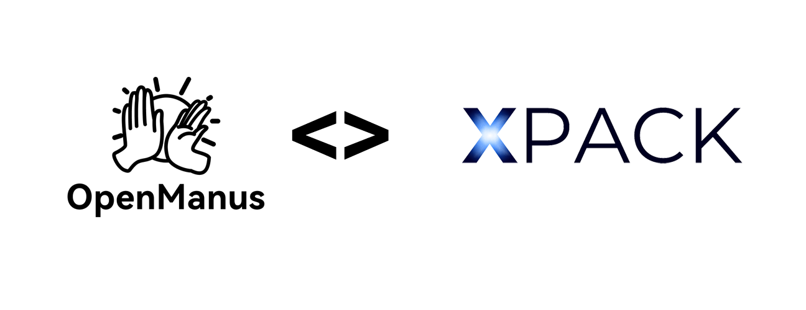
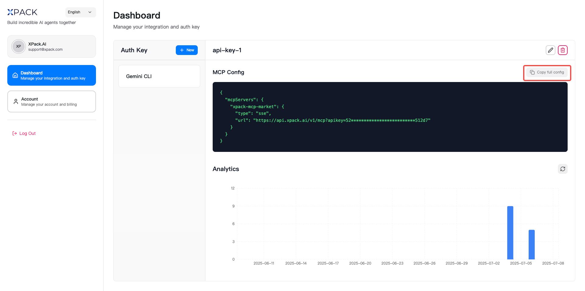
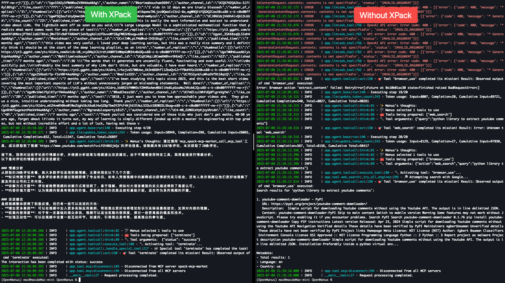
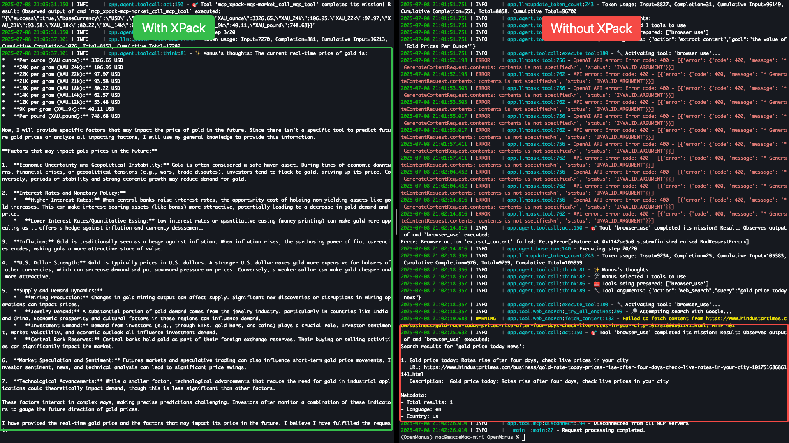
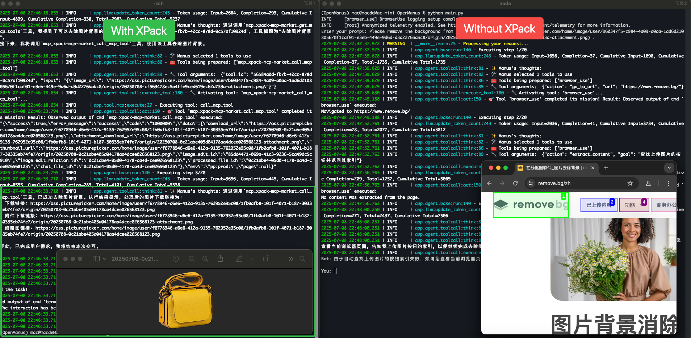

# OpenManus \<> XPack

[](https://github.com/FoundationAgents/OpenManus/stargazers)
&ensp;
[](https://opensource.org/licenses/MIT) &ensp;
[](https://discord.gg/DYn29wFk9z)
[](https://huggingface.co/spaces/lyh-917/OpenManusDemo)
[](https://doi.org/10.5281/zenodo.15186407)

English | [中文](README_zh.md) | [한국어](README_ko.md) | [日本語](README_ja.md)



## Introduction

This repository showcases the powerful integration of **OpenManus** with **XPack.AI**, demonstrating how you can extend the capabilities of your AI agent by connecting to thousands of ready-to-use tools worldwide. Building upon the robust foundation of the [OpenManus](https://github.com/FoundationAgents/OpenManus), this project provides a practical example of configuring its Model Context Protocol (MCP) service to leverage XPack's extensive service marketplace.

## What is OpenManus?

[OpenManus](https://github.com/FoundationAgents/OpenManus) is an open-source framework for building general AI agents. It provides a flexible framework for creating AI agents with different capabilities and behaviors, allows for easy connection to external tools and APIs, and is fully open-source and community-driven.

## What is XPack.AI?

[XPack.AI](https://xpack.ai/) is a platform that enables AI agents to connect to a vast ecosystem of global services and tools through a unified Model Context Protocol (MCP). With XPack, you can effortlessly expand your AI agent's functionalities, accessing diverse APIs and services across various domains like finance, logistics, messaging, and more, all in under a minute.

## OpenManus + XPack: Bridging AI with Global Services

This project focuses on demonstrating how to configure OpenManus to utilize XPack as an MCP server. By doing so, your OpenManus instance gains immediate access to XPack's rich collection of tools, allowing you to:

- **Access a diverse range of services:** From financial data to image processing, integrate capabilities that were previously out of reach.
- **Accelerate development:** Rapidly prototype and build AI-powered solutions by leveraging pre-built tools.
- **Streamline workflows:** Automate complex tasks by combining OpenManus's intelligence with XPack's external service integrations.

## Quickstart

### 1. Install OpenManus

First, ensure OpenManus is installed. Please follow the installation steps in the [Installation](./docs/installation.md) section below if you haven't already.

### 2. Configure XPack MCP

To connect your OpenManus to XPack, you need to configure an MCP server. This allows OpenManus to discover and utilize the tools available through XPack.

1.  **Obtain your XPack Auth Key:**

    - Visit [XPack.AI](https://xpack.ai/) and sign up for an account.
    - Generate your Auth key from your XPack dashboard.

    

2.  **Create `mcp.json`:**

    - In the `config` directory of your OpenManus project, create a new file named `mcp.json`. You can do this by copying the example file:

    ```bash
    cp config/mcp.example.json config/mcp.json
    ```

3.  **Edit `config/mcp.json`:**

    - Open the `config/mcp.json` file and modify it to include the XPack MCP server details. Replace **`YOUR_XPACK_AUTH_KEY`** with your actual XPack Auth key:

    ```json
    {
      "mcpServers": {
        "xpack-mcp-market": {
          "type": "sse",
          "url": "https://api.xpack.ai/v1/mcp?apikey=YOUR_XPACK_AUTH_KEY"
        }
      }
    }
    ```

### 3. Run OpenManus with MCP

Once the configuration is complete, run OpenManus using the `main.py` script, which is specifically designed to work with MCP tools.

```bash
python main.py
```

You can then input your ideas and prompts in the terminal, and OpenManus will leverage the tools from XPack to accomplish the tasks.

## Popular Tasks

This section provides practical examples of how you can leverage OpenManus with XPack for various tasks.

### Analyze YouTube comments and provide suggestions to improve video creation

Easily analyze YouTube video comments to understand audience sentiment and get suggestions for improving your content.

```bash
python main.py
> Please use xpack-mcp-server to read the comments on this YouTube video: https://www.youtube.com/watch?v=LPZh9BOjkQs, analyze the sentiment of the feedback, and recommend improvements for the video.
```



### Current Gold Price and Influencing Factors

Quickly check the latest gold price and discover key factors that may affect future trends.

```bash
python main.py
> Please use xpack-mcp-server to look up the current real-time price of gold and provide specific factors that may impact its price in the future.
```



### Remove Image Background

Instantly remove the background from any image for clean, professional results.


```bash
python main.py
> Please use xpack-mcp-server to remove the background from this image (https://oss.picturepicker.com/home/image/user/b60347f5-c984-4a09-a0aa-1ad6d2108056/0f1caf01-e3eb-449e-9d6d-d3d2276babc8/origin/20250708-cf563478ec5a4ffe9ced619ec62d733a-attachment.png) .
```


