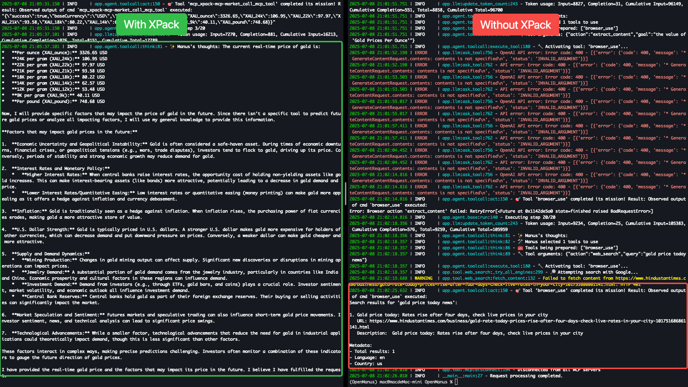

# OpenManus \<> XPack

[](https://opensource.org/licenses/MIT) &ensp;


[English](README.md) | [中文](README_zh.md) | 한국어 | [日本語](README_ja.md)

## 소개

이 저장소는 **OpenManus**와 **XPack.AI**의 강력한 통합을 보여주며, 전 세계 수천 개의 즉시 사용 가능한 도구에 연결하여 AI 에이전트의 기능을 확장하는 방법을 시연합니다. [OpenManus](https://github.com/FoundationAgents/OpenManus)의 견고한 기반 위에 구축된 이 프로젝트는 XPack의 광범위한 서비스 마켓플레이스를 활용하기 위한 모델 컨텍스트 프로토콜(MCP) 서비스 구성의 실용적인 예를 제공합니다.

## OpenManus란 무엇인가요?

[OpenManus](https://github.com/FoundationAgents/OpenManus)는 범용 AI 에이전트를 구축하기 위한 오픈소스 프레임워크입니다. 다양한 능력과 동작을 가진 AI 에이전트를 생성하기 위한 유연한 프레임워크를 제공하고, 외부 도구 및 API에 쉽게 연결할 수 있으며, 완전히 오픈소스이고 커뮤니티 주도입니다.

## XPack.AI란 무엇인가요?

[XPack.AI](https://xpack.ai/)는 통합된 모델 컨텍스트 프로토콜(MCP)을 통해 AI 에이전트가 글로벌 서비스와 도구의 방대한 생태계에 연결할 수 있게 하는 플랫폼입니다. XPack을 사용하면 AI 에이전트의 기능을 쉽게 확장하고, 금융, 물류, 메시징 등 다양한 도메인의 다양한 API와 서비스에 1분 이내에 액세스할 수 있습니다.

## OpenManus + XPack: AI와 글로벌 서비스 연결

이 프로젝트는 OpenManus를 XPack을 MCP 서버로 활용하도록 구성하는 방법을 시연하는 데 중점을 둡니다. 이를 통해 OpenManus 인스턴스는 XPack의 풍부한 도구 컬렉션에 즉시 액세스할 수 있으며, 다음과 같은 것들이 가능해집니다:

- **다양한 서비스에 액세스:** 금융 데이터부터 이미지 처리까지, 이전에는 접근할 수 없었던 기능을 통합합니다.
- **개발 가속화:** 사전 구축된 도구를 활용하여 AI 기반 솔루션을 빠르게 프로토타입하고 구축합니다.
- **워크플로 간소화:** OpenManus의 지능과 XPack의 외부 서비스 통합을 결합하여 복잡한 작업을 자동화합니다.

## 빠른 시작

### 1. OpenManus 설치

먼저 OpenManus가 설치되어 있는지 확인하세요. 아직 설치하지 않았다면 아래 [설치](./docs/installation.md) 섹션의 설치 단계를 따라 주세요.

### 2. XPack MCP 구성

OpenManus를 XPack에 연결하려면 MCP 서버를 구성해야 합니다. 이를 통해 OpenManus가 XPack을 통해 사용 가능한 도구를 발견하고 활용할 수 있습니다.

1.  **XPack 인증 키 획득:**

    - [XPack.AI](https://xpack.ai/)를 방문하여 계정을 등록하세요.
    - XPack 대시보드에서 인증 키를 생성하세요.

    

2.  **`mcp.json` 생성:**

    - OpenManus 프로젝트의 `config` 디렉토리에 `mcp.json`이라는 새 파일을 생성합니다. 예제 파일을 복사하여 수행할 수 있습니다:

    ```bash
    cp config/mcp.example.json config/mcp.json
    ```

3.  **`config/mcp.json` 편집:**

    - `config/mcp.json` 파일을 열고 XPack MCP 서버 세부 정보를 포함하도록 수정합니다. **`YOUR_XPACK_AUTH_KEY`**를 실제 XPack 인증 키로 교체하세요:

    ```json
    {
      "mcpServers": {
        "xpack-mcp-market": {
          "type": "sse",
          "url": "https://mcp.xpack.ai/v1/mcp?apikey=YOUR_XPACK_AUTH_KEY"
        }
      }
    }
    ```

### 3. MCP로 OpenManus 실행

구성이 완료되면 MCP 도구 전용으로 설계된 `main.py` 스크립트를 사용하여 OpenManus를 실행합니다.

```bash
python main.py
```

그런 다음 터미널에서 아이디어와 프롬프트를 입력할 수 있으며, OpenManus는 XPack의 도구를 활용하여 작업을 수행합니다.

## 인기 작업

이 섹션에서는 다양한 작업에 OpenManus와 XPack을 활용하는 실용적인 예제를 제공합니다.

### YouTube 댓글 분석 및 비디오 제작 개선 제안

YouTube 비디오 댓글을 쉽게 분석하여 시청자 감정을 이해하고 콘텐츠 개선 제안을 받을 수 있습니다.

```bash
python main.py
> Please use xpack-mcp-server to read the comments on this YouTube video: https://www.youtube.com/watch?v=LPZh9BOjkQs, analyze the sentiment of the feedback, and recommend improvements for the video.
```


### 현재 금 가격 및 영향 요인

최신 금 가격을 빠르게 확인하고 미래 트렌드에 영향을 줄 수 있는 주요 요인을 발견합니다.

```bash
python main.py
> Please use xpack-mcp-server to look up the current real-time price of gold and provide specific factors that may impact its price in the future.
```



### 이미지 배경 제거

모든 이미지의 배경을 즉시 제거하여 깔끔하고 전문적인 결과를 얻을 수 있습니다.


```bash
python main.py
> Please use xpack-mcp-server to remove the background from this image (https://oss.picturepicker.com/home/image/user/b60347f5-c984-4a09-a0aa-1ad6d2108056/0f1caf01-e3eb-449e-9d6d-d3d2276babc8/origin/20250708-cf563478ec5a4ffe9ced619ec62d733a-attachment.png) .
```


