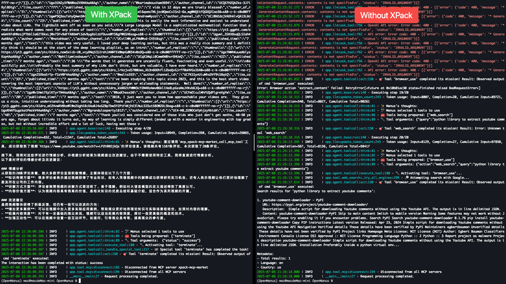
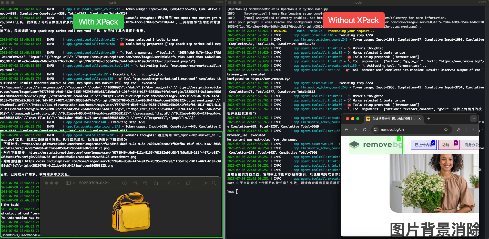

# OpenManus \<> XPack

[](https://opensource.org/licenses/MIT) &ensp;


[English](README.md) | 中文 | [한국어](README_ko.md) | [日本語](README_ja.md)

## 介绍

本仓库展示了 **OpenManus** 与 **XPack.AI** 的强大集成，演示了如何通过连接全球数千个即用型工具来扩展您的AI代理能力。基于 [OpenManus](https://github.com/FoundationAgents/OpenManus) 的强大基础，本项目提供了配置其模型上下文协议（MCP）服务以利用XPack广泛服务市场的实际示例。

## 什么是 OpenManus？

[OpenManus](https://github.com/FoundationAgents/OpenManus) 是一个用于构建通用AI代理的开源框架。它提供了一个灵活的框架来创建具有不同能力和行为的AI代理，允许轻松连接到外部工具和API，并且完全开源和社区驱动。

## 什么是 XPack.AI？

[XPack.AI](https://xpack.ai/) 是一个平台，使AI代理能够通过统一的模型上下文协议（MCP）连接到全球服务和工具的庞大生态系统。使用XPack，您可以轻松扩展AI代理的功能，在不到一分钟的时间内访问金融、物流、消息传递等各个领域的多样化API和服务。

## OpenManus + XPack：连接AI与全球服务

本项目专注于演示如何配置OpenManus以将XPack用作MCP服务器。通过这样做，您的OpenManus实例可以立即访问XPack丰富的工具集合，使您能够：

- **访问多样化的服务：** 从金融数据到图像处理，集成以前无法触及的功能。
- **加速开发：** 通过利用预构建的工具快速原型化和构建AI驱动的解决方案。
- **简化工作流程：** 通过将OpenManus的智能与XPack的外部服务集成相结合来自动化复杂任务。

## 快速开始

### 1. 安装 OpenManus

首先，确保已安装OpenManus。如果您还没有安装，请按照下面[安装](./docs/installation.md)部分的安装步骤进行操作。

### 2. 配置 XPack MCP

要将您的OpenManus连接到XPack，您需要配置一个MCP服务器。这允许OpenManus发现和利用通过XPack提供的工具。

1.  **获取您的XPack认证密钥：**

    - 访问 [XPack.AI](https://xpack.ai/) 并注册一个账户。
    - 从您的XPack仪表板生成您的认证密钥。

    

2.  **创建 `mcp.json`：**

    - 在您的OpenManus项目的 `config` 目录中，创建一个名为 `mcp.json` 的新文件。您可以通过复制示例文件来完成此操作：

    ```bash
    cp config/mcp.example.json config/mcp.json
    ```

3.  **编辑 `config/mcp.json`：**

    - 打开 `config/mcp.json` 文件并修改它以包含XPack MCP服务器详细信息。将 **`YOUR_XPACK_AUTH_KEY`** 替换为您的实际XPack认证密钥：

    ```json
    {
      "mcpServers": {
        "xpack-mcp-market": {
          "type": "sse",
          "url": "https://api.xpack.ai/v1/mcp?apikey=YOUR_XPACK_AUTH_KEY"
        }
      }
    }
    ```

### 3. 使用MCP运行OpenManus

配置完成后，使用专门设计用于MCP工具的 `main.py` 脚本运行OpenManus。

```bash
python main.py
```

然后您可以在终端中输入您的想法和提示，OpenManus将利用XPack的工具来完成任务。

## 热门任务

本节提供了如何利用OpenManus与XPack进行各种任务的实际示例。

### 分析YouTube评论并提供改进视频创作的建议

轻松分析YouTube视频评论以了解观众情绪并获得改进内容的建议。

```bash
python main.py
> Please use xpack-mcp-server to read the comments on this YouTube video: https://www.youtube.com/watch?v=LPZh9BOjkQs, analyze the sentiment of the feedback, and recommend improvements for the video.
```



### 当前黄金价格和影响因素

快速查看最新的黄金价格并发现可能影响未来趋势的关键因素。

```bash
python main.py
> Please use xpack-mcp-server to look up the current real-time price of gold and provide specific factors that may impact its price in the future.
```


### 移除图像背景

即时移除任何图像的背景，获得干净、专业的效果。


```bash
python main.py
> Please use xpack-mcp-server to remove the background from this image (https://oss.picturepicker.com/home/image/user/b60347f5-c984-4a09-a0aa-1ad6d2108056/0f1caf01-e3eb-449e-9d6d-d3d2276babc8/origin/20250708-cf563478ec5a4ffe9ced619ec62d733a-attachment.png) .
```


